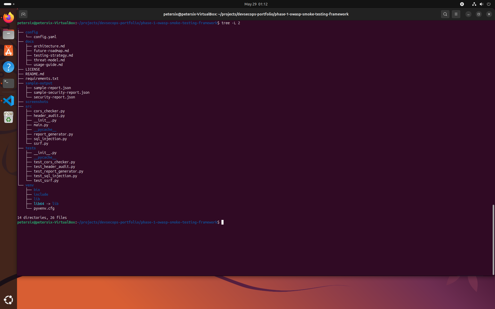
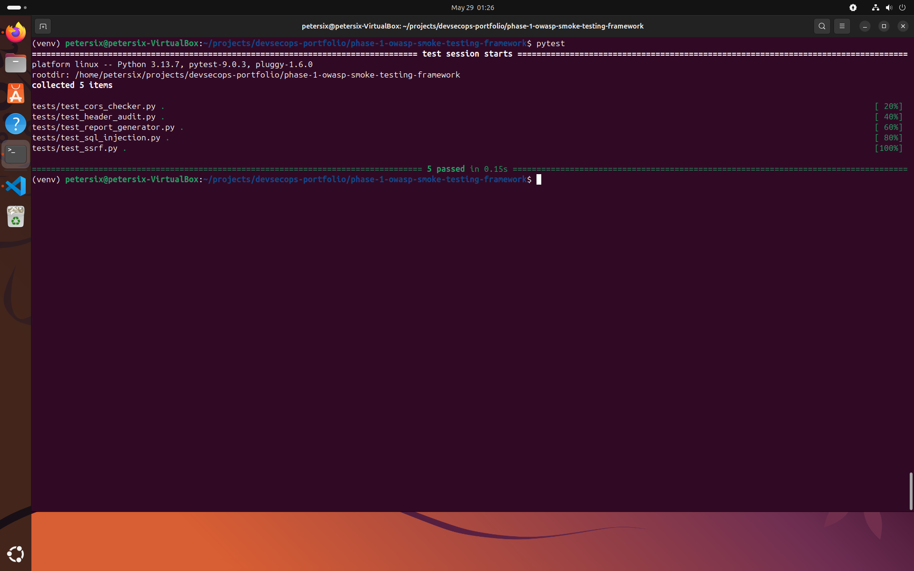
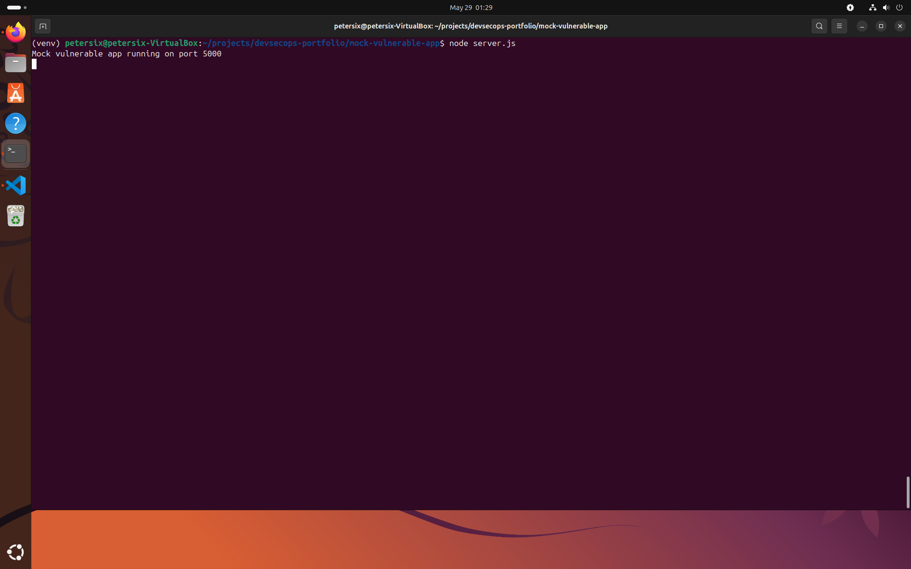
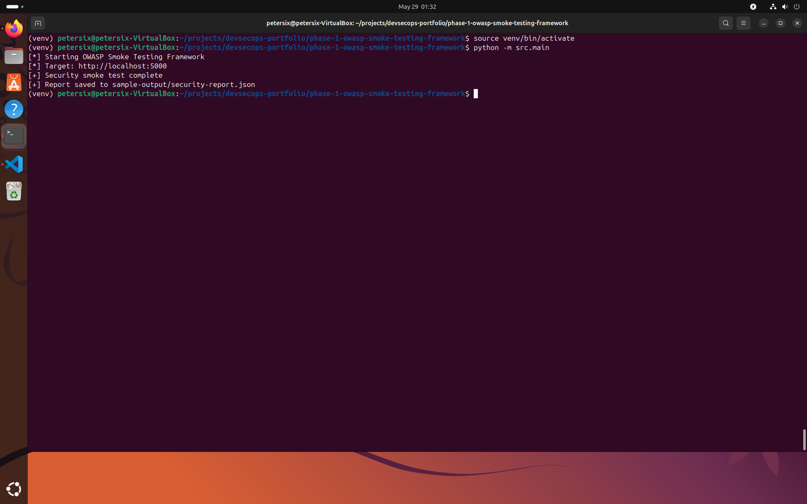
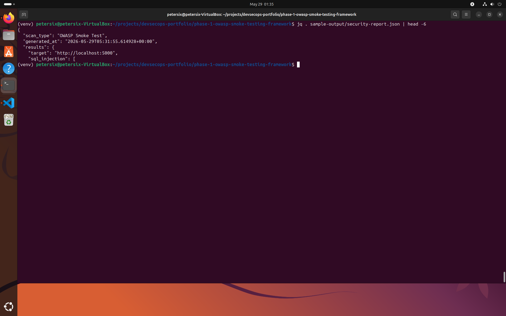
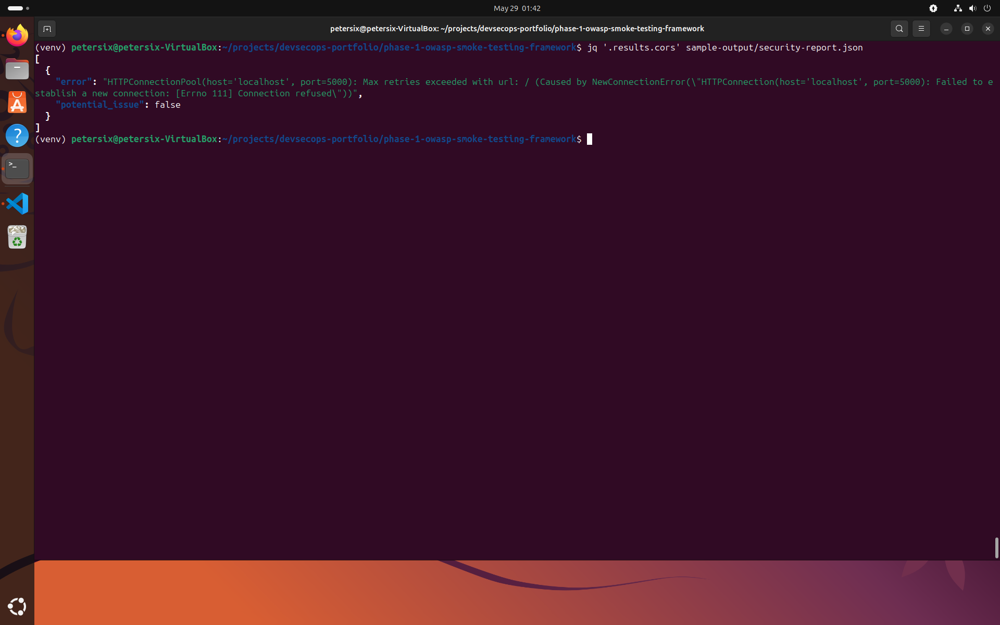

# Phase 1 — OWASP Smoke Testing Framework

A lightweight Python-based web application security testing framework focused on identifying common OWASP Top 10 vulnerabilities through automated smoke testing.

This project was built as part of a DevSecOps Engineering portfolio to demonstrate practical application security (AppSec), security automation, HTTP security analysis, and defensive security testing concepts.

---

# Objectives

This project is designed to strengthen practical DevSecOps and AppSec skills in:

* OWASP Top 10 awareness
* Security automation
* HTTP security analysis
* Secure coding practices
* Vulnerability validation
* Defensive security testing
* CI/CD security testing concepts

---

# Features

## Current Features

* SQL Injection smoke testing
* SSRF validation checks
* HTTP security header auditing
* CORS misconfiguration detection
* YAML-based configuration
* JSON security reporting
* Automated pytest test suite
* Modular scanner architecture

---

## Planned Features

* Authentication weakness detection
* TLS inspection
* Rate limiting validation
* Plugin-based testing engine
* Docker container support
* GitHub Actions integration
* CI/CD pipeline integration
* SIEM export capability
* Prometheus metrics support

---

# Project Structure

```text
phase-1-owasp-smoke-testing-framework/
│
├── config/
│   └── config.yaml
│
├── docs/
│   ├── architecture.md
│   ├── threat-model.md
│   ├── usage-guide.md
│   ├── testing-strategy.md
│   └── future-roadmap.md
│
├── sample-output/
│   └── sample-report.json
│
├── screenshots/
│
├── src/
│   ├── __init__.py
│   ├── main.py
│   ├── sql_injection.py
│   ├── ssrf.py
│   ├── header_audit.py
│   ├── cors_checker.py
│   └── report_generator.py
│
├── tests/
│
├── requirements.txt
├── README.md
└── LICENSE
```

---

# Security Modules

| Module              | Purpose                                |
| ------------------- | -------------------------------------- |
| sql_injection.py    | Detects basic SQL injection indicators |
| ssrf.py             | Validates potential SSRF exposure      |
| header_audit.py     | Audits HTTP security headers           |
| cors_checker.py     | Detects insecure CORS configurations   |
| report_generator.py | Generates structured JSON reports      |

---

# Example Security Checks

The framework currently validates:

* Missing Content-Security-Policy
* Missing Strict-Transport-Security
* Missing X-Frame-Options
* Missing X-Content-Type-Options
* Missing Referrer-Policy
* Weak CORS configurations
* Potential SQL injection behavior
* Potential SSRF metadata endpoint exposure

---

# Technologies Used

* Python 3
* Requests
* PyYAML
* Pytest
* JSON
* YAML

---

# Screenshots

## Project Structure

Shows the overall project organization and modular architecture.



---

## Automated Test Suite

All automated tests passing successfully.



---

## Mock Vulnerable Application

Local intentionally vulnerable application used for safe testing and validation.



---

## Framework Execution

Executing the OWASP smoke testing framework against the local testing target.



---

## JSON Report Generation

Example JSON security report generated by the framework.



---

## CORS Misconfiguration Detection

Detection of intentionally insecure CORS configuration.



---

# Running the Project

## Create Virtual Environment

```bash
python3 -m venv venv
```

Activate:

```bash
source venv/bin/activate
```

---

## Install Dependencies

```bash
pip install -r requirements.txt
```

---

## Run the Framework

```bash
python -m src.main
```

---

## Run Tests

```bash
pytest
```

---

# Sample Findings

Example report output:

```json
{
  "scan_type": "OWASP Smoke Test",
  "results": {
    "target": "http://localhost:5000",
    "sql_injection": [
      {
        "potential_issue": true
      }
    ],
    "ssrf": [
      {
        "potential_issue": true
      }
    ],
    "cors": [
      {
        "potential_issue": true
      }
    ]
  }
}
```

---

# Security Considerations

This framework is intended strictly for:

* educational purposes
* defensive security validation
* authorized security assessments
* lab environments

Do **NOT** scan systems without explicit authorization.

---

# Testing Environment

The framework was validated against a locally hosted intentionally vulnerable application designed to simulate:

* SQL Injection indicators
* SSRF behavior
* Missing security headers
* Insecure CORS configurations

This allows safe and reproducible testing without targeting production systems.

---

# Documentation

Additional documentation is available in the `docs/` directory:

* Architecture Overview
* Threat Model
* Usage Guide
* Testing Strategy
* Future Roadmap

---

# Future Improvements

Planned enhancements include:

* Plugin-based architecture
* Authentication testing
* TLS validation
* API security testing
* Docker support
* GitHub Actions integration
* SIEM integration
* Prometheus metrics
* CI/CD security pipeline support

---

# Long-Term DevSecOps Goals

This project is intended to evolve into a lightweight security validation framework capable of integrating with:

* CI/CD pipelines
* Docker containers
* Terraform infrastructure
* Kubernetes deployments
* Monitoring and observability stacks

to simulate real-world DevSecOps workflows.

---

# License

This project is licensed under the MIT License.
